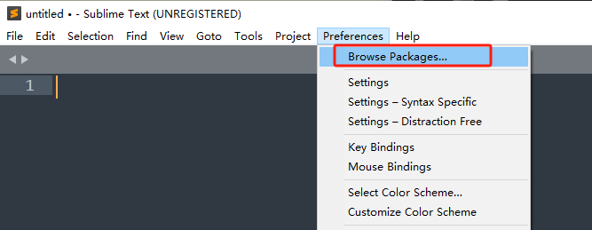

# SublimeBBS_NGA

支持 [NGA](https://bbs.nga.cn/) BBS 代码语法 的 Sublime Text 插件。自动识别后缀为 `.nga` 和 `.bbsnga` 的文件。

覆盖 NGA 常用 BBS 代码的**语法高亮**、**代码补全**。

## 特性

- **语法高亮**：包含**包裹光标的代码作用域高亮**、**未闭合代码块提示**

- **代码补全**

- **专楼模板**

## 安装

**不使用Git：** 从 [GitHub](https://github.com/stone5265/SublimeBBS_NGA) 下载最新的源码，将整个文件夹复制到 Packages 目录下。

**使用Git：** 在 Packages 目录下克隆仓库：

    git clone git://github.com/stone5265/SublimeBBS_NGA.git

Packages 目录在不同电脑位于不同位置，可以通过以下操作找到该目录：

    Preferences -> Browse Packages (Sublime Text 菜单)

